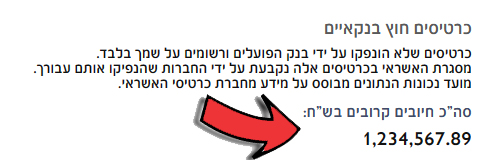

# Bank Hapoalim's Credit Card Totaler Extension

This extension automatically aggregates the balances of external credit cards displayed on Bank Hapoalim's website into a single total. Now, you no longer have to manually add up card amounts – see the combined balance at a glance right above the card details!

> [!IMPORTANT]
> You have your external credit cards linked and displayed on Bank Hapoalim's website.
> If you don't know how to do it, Google is your friend...

## Installation
Easiest way to install is by visiting either the Chrome web store or Mozilla Addons and download the extension:
### Chrome Web Store:
https://chrome.google.com/webstore/detail/credit-card-totaler/holdmkefblpbaehhnciikbcfhiipmlfg

### Mozilla Addons
https://addons.mozilla.org/en-US/firefox/addon/hapoalim-credit-card-totaler/

### Running locally
Clone this repository: `git clone https://github.com/ocp1006/bank-hapoalim-credit-card-totaler.git`

Chromium based browser

1. Type `chrome://extensions/`
2. Enable "Developer mode".
3. Click on "Load unpacked".
4. Navigate to the directory where you cloned the repository and select it.
 

Mozilla Firefox (Nightly or developer edition only)

1. Type `about:debugging`.
2. Click on "Load Temporary Add-on".
3. Navigate to the directory where you cloned the repository and select the `manifest.json` file.
 

## Usage

Navigate to Bank Hapoalim's credit card page after installing the extension. The total will be automatically calculated and displayed on the page.

## Privacy
> [!IMPORTANT]
> This extension does not track any personal information or send data anywhere. All calculations are done locally in the user's browser, ensuring your data remains private and secure.
> 
## Contributing

Pull requests are welcome. For major changes, please open an issue first to discuss what you would like to change.

## License

[MIT](https://choosealicense.com/licenses/mit/)

## Disclaimer

This extension is not affiliated, associated, authorized, endorsed by, or in any way officially connected with Bank Hapoalim, its webside or any of its subsidiaries or its affiliates. The official bank website can be found at its respective domain. The name as well as related names, marks, emblems, and images are registered trademarks of their respective owners.
